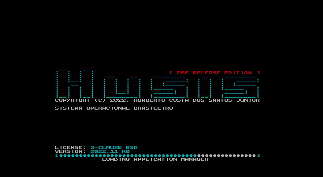
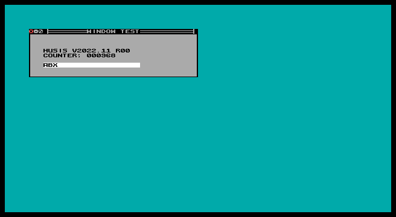
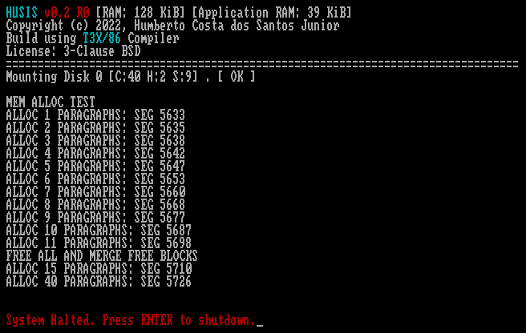
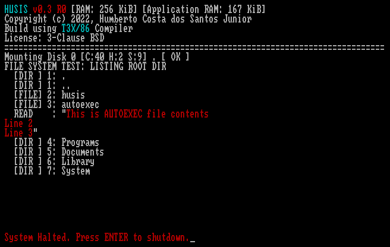
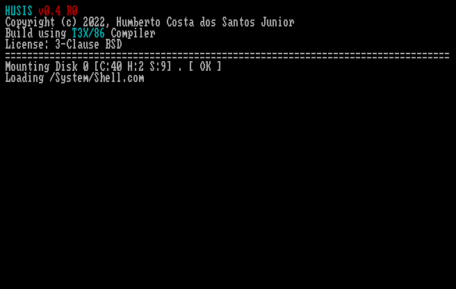
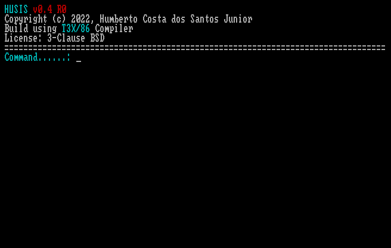
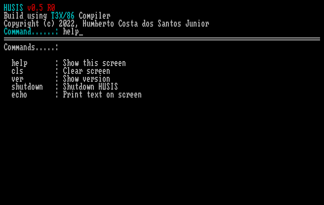

# HUSIS - Operating System for IBM PC and Compatibles

HUSIS is a text-based operating system for 8086/8088 CPUs, with custom EGA/VGA fonts to create an interactive and dynamic interface.

This Operating System will implement minimum DOS INT 0x21 function set to run [T3X/86 with Low Level Extensions](https://github.com/humbertocsjr/T3X86LL) and [T3X/86](https://t3x.org/t3x) Applications without modifications.

Recommended code editor: VS Code (with t3x extension added)

## Project files (*.PRJ)

This files contains filenames imported to unified T3X file used to build.

## EGA/VGA Fonts

HUSIS uses EGA/VGA 8x8 fonts, with 128 fixed chars (including CP850-like latin chars, upper case only), and 128 custom chars per application.

The app can read any custom font files into 128 avail chars, including UTF-8(pending) extensions and lower case versions(pending).

Font file format is 100% ascii file, optimize to easy user manipulation and edition. 

## Current Roadmap Topics

- Full customizable font
- Library Manager
- User Interface Controls
    - Window
    - Label
    - ListBox
    - TextBox
    - TextArea
- File Manager Implementation
- Test Multitask performance impact in User Interface API

## Changes in current release

- Shell Replacement
- User Interface prototype
- Font Manager
- Initial Bold Font
- Splash screen

[Download Floppy Images](https://github.com/humbertocsjr/HUSIS/releases/tag/v2022.11r0-alpha)

## Boot Order

- Bootloader  - /BOOT/*
- Load HUSIS Kernel - /HUSIS/*
- Load Common Kernel Extensions - /SYSTEM/*
- Load Video Controller Kernel Extension - /SYSTEM/EGA.*
- Load Shell (User interface/Font Manager) - /SYSTEM/SHELL/*
- Load Application Manager (Event manager) - /SYSTEM/APPMAN/*
- Load File Manager (Main user application) - /SYSTEM/FILEMAN/*

## Terminal Implementation

This implements a static screen terminal without scroll function, my inspiration is IBM CICS from Mainframe, with forms based screens.

## Minimum Requiriments

IBM PC or Compatible

360 KiB Floppy Disk

EGA/VGA Video Card (MDA/CGA Video Card/Monitor is not suported)

256 KiB RAM (Standalone) or 384 KiB RAM (DOS App mode)

## How to use

You can run as Standalone Operating System or DOS Application.

The DOS Application mode preserves DOS Structures, and limit the RAM usage to area on MCB (DOS Memory Control Block).

#### DOS App mode

This mode is created for Debug use and running on machines with ROM DOS, need Minix File System in separated disk.

Run 'HUSIS.COM 0 80 2 18 /System/Autoexec.hsh'

Command arguments:

- Disk number: 0 = A:, 1 = B:, 128 = C:, 129 = D:
- Cilinders
- Heads
- Sectors
- Autoexec file path

## Build Requirements

- DOS(FreeDOS/MS-DOS/DOSBOX)
- MinixFS Tool 

## Embedded Build Tools

- [T3X/86](https://github.com/humbertocsjr/T3X86LL)
- [Old-School Assembler](https://github.com/humbertocsjr/osasm)
- [MinixFS Tool](https://github.com/humbertocsjr/minixfs)

## Build on DOS

Use MAKE.BAT command to build

## Build on Linux / MacOS

Use 'make' command to build.

Use 'make img' to generate standalone floppy image 

Use 'make test' to generate standalone floppy image and run on DOSBOX(Standalone Mode)

Use 'make testdos' run on DOSBOX(DOS Mode)

## Objectives

### MinixFS Bootloader

- [x] Convert my bootloader to run HUSIS Kernel based on T3X/86
- [ ] Convert Assembly code from Old-School Assembler to S86
- [ ] Translate the code from Portuguese to English

### HUSIS Kernel

- [x] Memory management - DOS Mode using limits on MCB
- [x] Memory management - Standalone Mode
- [x] Stream I/O Infrastructure
- [x] Terminal I/O using Stream
- [x] BIOS Disk I/O using Stream
- [x] File System Infrastructure
- [x] Minix File System - Read
- [ ] Minix File System - Write
- [x] Load and Execute Application from File
- [x] Capture return and exit application
- [x] COM Executable Support (ORG 0x100 ARGS 0x81 STACK 0xffff SIZE 64 KiB)
- [x] PRG Executable Support (ORG 0x800 ARGS 0x0 STACK 0x800 SIZE Dinamic)
- [ ] Serial I/O using Stream
- [ ] Parallel Port I/O using Stream
- [ ] Multitask for background drivers

### Video Support

- [x] Initialize 80x43 text video mode (Requires EGA/VGA or compatible)
- [x] Set custom 8x8 font
- [x] Base Font Support
- [ ] Custom Extended Font Support
- [ ] UTF-8 Extended Font Support

### Fonts

- [x] Default Bold Base Font
- [ ] Slim Base Font
- [x] Draw Extended Font
- [x] File Manager Extended Font

### DOS API

- [x] Implement Standard Output INT 0x21 AH 0x40 BX 1
- [x] Implement Standard Error Output INT 0x21 AH 0x40 BX 2
- [x] Implement Standard Input INT 0x21 AH 0x3f BX 0
- [ ] Implement Exit
- [ ] Implement File Open
- [ ] Implement File Close
- [ ] Implement File First Item on Directory
- [ ] Implement File Next Item on Directory
- [ ] Implement File Read
- [ ] Implement File Write
- [ ] Implement File Rename
- [ ] Implement File Delete
- [ ] Implement Directory Create
- [ ] Implement Directory Change Current
- [ ] Implement Directory Delete

### HUSIS API - Used by Applications

- [ ] Stream Implementation API
- [ ] File System Implementation API

### Drivers

- [x] EGA Video Controller
- [ ] FAT12/16 File System Driver
- [ ] NE2000 Packet Driver
- [ ] IPX Protocol Stack
- [ ] Unified Text User Interface Driver

### Applications

- [ ] File Manager
- [ ] Command Prompt
- [ ] Text Editor
- [ ] BASIC Interpreter
- [ ] Custom T3X/86 with PRG Support (Minimal RAM usage, fixed 2 KiB Stack)

# Milestones in images

First use of Bootloader: (86Box Emulator with Xi8088 machine with 128 KiB)

HUSIS v0.1 R0: [Download](https://github.com/humbertocsjr/HUSIS/releases/tag/v0.1.0-alpha)

- Implemented Terminal I/O, Disk I/O and Prototype of MinixFS

HUSIS v0.2 R0: [Download](https://github.com/humbertocsjr/HUSIS/releases/tag/v0.2.0-alpha)

- Memory Manager implemented (Known bugs: Memory Defrag don't works)

HUSIS v0.3 R0: [Download](https://github.com/humbertocsjr/HUSIS/releases/tag/v0.3.0-alpha)

- FIX: Memory Defrag
- File System API
- MinixFS Open/Close/Read implemented

HUSIS v0.4 R0: [Download](https://github.com/humbertocsjr/HUSIS/releases/tag/v0.4.0-alpha)

- COM File Loader (Prototype)
- Fist Shell (Prototype)

HUSIS v0.5 R0: [Download](https://github.com/humbertocsjr/HUSIS/releases/tag/v0.5.0-alpha)

- Shell commands prototype

HUSIS v2022.11 R0: [Download](https://github.com/humbertocsjr/HUSIS/releases/tag/v2022.11r0-alpha)

- Shell Replacement
- User Interface prototype
- Font Manager
- Initial Bold Font
- Splash screen

