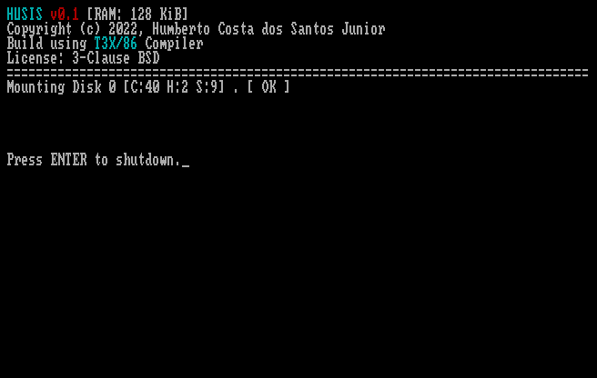

# HUSIS - Operating System for IBM PC and Compatibles

This Operating System will implements minimum DOS INT 0x21 function set to run [T3X/86 with Low Level Extensions](https://github.com/humbertocsjr/T3X86LL) and [T3X/86](https://t3x.org/t3x) Applications without modifications.

Bootloader: (86Box Emulator with Xi8088 machine with 128 KiB)

HUSIS v0.1.0: [Download](https://github.com/humbertocsjr/HUSIS/releases/tag/v0.1.0-alpha)

## Minimum Requiriments

IBM PC or Compatible

Floppy Disk

CGA/EGA/VGA Video Card (MDA Partial Support, in implementation)

128 KiB RAM (Standalone) or 256 KiB RAM (DOS App mode)

## How to use

You can run as Standalone Operating System or DOS Application.

The DOS Application mode preserves DOS Structures, and limit the RAM usage to area on MCB (DOS Memory Control Block).

#### DOS App mode

This mode is created for Debug use and running on machines with ROM DOS, like HP Palmtop PC 95LX/100LX/200LX.

Run 'HUSIS.COM'

## Build Requirements

- DOS(FreeDOS/MS-DOS/DOSBOX)

## Embedded Build Tools

- [T3X/86](https://github.com/humbertocsjr/T3X86LL)
- [Old-School Assembler](https://github.com/humbertocsjr/osasm)

## Build on DOS

Use MAKE.BAT command to build

## Build on Linux

Use 'make' command to build.

Use 'make img' to generate standalone floppy image (Use SUDO to mount image)

Use 'make test' to generate standalone floppy image and run on DOSBOX(Standalone Mode)

Use 'make testdos' run on DOSBOX(DOS Mode)

## Objectives

### MinixFS Bootloader

- [x] Convert my bootloader to run HUSIS Kernel based on T3X/86
- [ ] Convert Assembly code from Old-School Assembler to S86
- [ ] Translate the code from Portuguese to English

### HUSIS Kernel

- [ ] Memory management - DOS Mode using limits on MCB
- [ ] Memory management - Standalone Mode
- [x] Stream I/O Infrastructure
- [x] Terminal I/O using Stream
- [x] BIOS Disk I/O using Stream
- [ ] File System Infrastructure
- [ ] Minix File System
- [ ] Load and Execute Application from File
- [ ] COM Executable Support (ORG 0x100 ARGS 0x81 STACK 0xffff SIZE 64 KiB)
- [ ] PRG Executable Support (ORG 0x800 ARGS 0x0 STACK 0x800 SIZE Dinamic)
- [ ] Serial I/O using Stream
- [ ] Parallel Port I/O using Stream
- [ ] Multitask for background drivers

### DOS API

- [x] Implement Standard Output INT 0x21 AH 0x40 BX 1
- [x] Implement Standard Error Output INT 0x21 AH 0x40 BX 2
- [x] Implement Standard Input
- [ ] Implement File Open
- [ ] Implement File Close
- [ ] Implement File First Item on Directory
- [ ] Implement File Next Item on Directory
- [ ] Implement File Read
- [ ] Implement File Write
- [ ] Implement File Rename
- [ ] Implement File Delete
- [ ] Implement Directory Create
- [ ] Implement Directory Change Current
- [ ] Implement Directory Delete

### HUSIS API - Used by Applications

- [ ] Stream Implementation API
- [ ] File System Implementation API

### Drivers

- [ ] FAT12/16 File System Driver
- [ ] NE2000 Packet Driver
- [ ] IPX Protocol Stack
- [ ] Unified Text User Interface Driver

### Applications

- [ ] Command Prompt
- [ ] Text Editor
- [ ] BASIC Interpreter
- [ ] Custom T3X/86 with PRG Support (Minimal RAM usage, fixed 2 KiB Stack)
